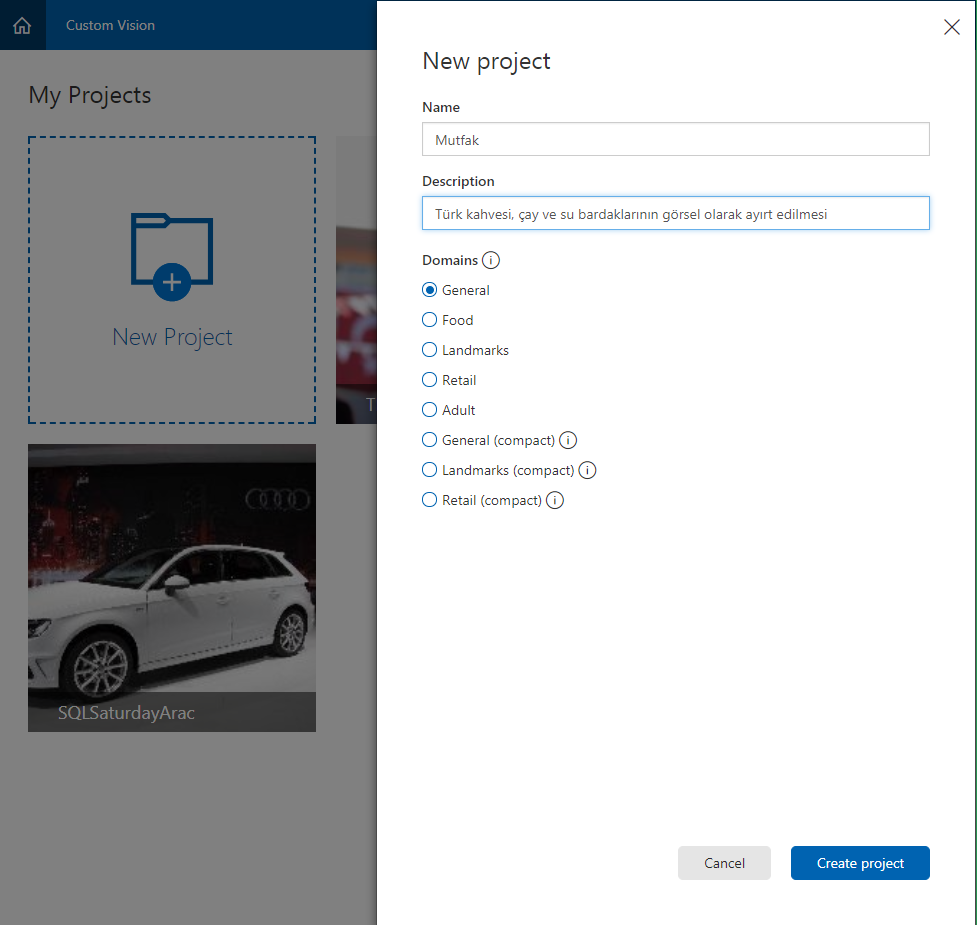
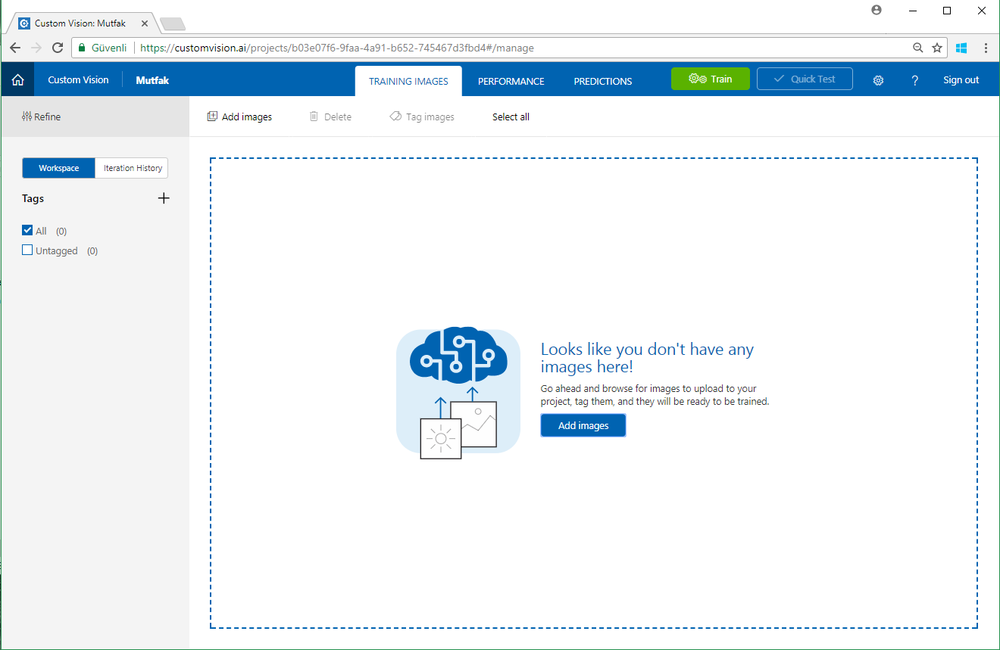
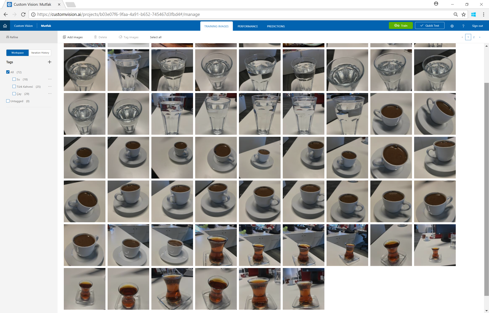
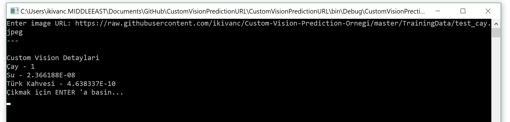
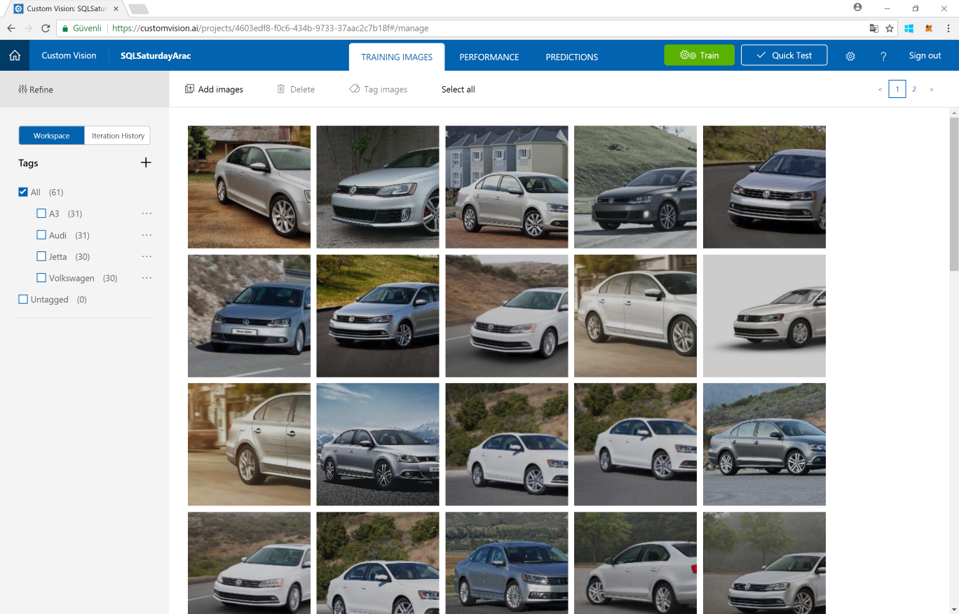

# Custom Vision Services Uygulama Örneği

Microsoft'un AI alanında tüm geliştiricilere sunmuş olduğu çok fazla ürün seçenekleri bulunuyor. Bu ürünler arasında hem veri bilimcilerin kullanabileceği hem de yazılım geliştirebileceği yapay zeka tabanlı servisler bulunuyor.

Bu örnek de görüntü işleme konusunda yazılım geliştiricilerin kullanabileceği, özel olarak tanımlatmak isteyeceğiniz nesneleri tanımlayabileceğiniz bir platform.

## Custom Vision Services'in çalışma mantığı
Custom Vision API'ın çalışma mantığı tanınmasını istediğiniz fotoğraflarla sistemi eğiterek, bir tahmin modelinin oluşturulmasını sağlıyor. Daha sonra bu modeli kullanarak test etmek istediğiniz fotoğrafların bu modellere ne kadar yakın olduğunu size dönebiliyor.

Buradaki temel mantık fotoğraflarda benzerlikler üzerinden eğitildiği için tam olarak neyi öğrenmesi gerektiğini sizin verdiğiniz fotoğrafların içeriği ve eklediğiniz ``Tag`` belirliyor.

Bir örnek üzerinde inceleyecek olursak Türkiye'ye has çay bardağı, Türk kahvesi ve Su bardaklarının bulunduğu fotoğraflarla sistemi eğiterek, bundan sonra vereceğiniz fotoğrafların içerisinde bu nesneler geçip geçmediğini görebileceksiniz.

## Custom Vision Services projesi oluşturulması

[Microsoft Cognitive Service](http://www.microsoft.com/cognitive) 'in altında yer alan servislerden birisi olan [Custom Vision Services](http://www.customvision.ai) ile Türk kahvesi fincanı, çay ve su bardaklarını görsel olarak ayırt edilebilmesi için bir örnek projeyi oluşturabilmek için aşağıdaki detayları tamamlamamız gerekiyor.

Yeni bir proje oluştururken kullandığınız göreseller aşağıdaki kategorilerden birisine giriyorsa görsellerin tanımlanması daha kolay bir şekilde gerçekleştirilebiliyor. Eğer değilse genel başlığını kullanabilirsiniz.




Projenizi oluşturduktan sonra aşağıdaki alana fotoğraflarınızı yükleyin. Eğer bu örneği gerçekleştirmek isterseniz [Örnek Fotoğrafları](https://github.com/ikivanc/Custom-Vision-Prediction-Ornegi/tree/master/TrainingData/Office) link adresinden bulabilirsiniz.



Girilen fotoğrafları grup grup girerek fotoğrafların tag'lerini girin. Genellikle nesnelerde farklı açılardan farklı uzaklıklardan fotoğraf çekmek çok daha yardımcı olacaktır. 



Fotoğrafları yüklemeyi gerçekleştirip tamamladıktan sonra Sağ üst taraftaki ``Train`` butonuna tıklayarak sisteminizi eğitebilir ve sonrasında da ``Quick Test`` bölümünden uygulamanızın çalışmasını test edebilirsiniz.

## Custom Vision API ile C# kodu ile entegre edilmesi
Aşağıdaki kod örneğinde de girdiğiniz bir fotoğraf URL'i aracılığı ile fotoğrafınızın içeriğini tespit edebilirsiniz. isterseniz de fotoğrafı yükleyerek de test edebilirsiniz.

```csharp
...
        static async void MakeRequest()
        {
            var client = new HttpClient();

            // Request headers
            // Buraya Prediction API Key'inizi girebilirsiniz.
            client.DefaultRequestHeaders.Add("Prediction-key", "YOUR PREDICTION KEY");

            Console.Write("Enter image URL: ");
            var imageUrl = Console.ReadLine();

            //Buraya URL ile sorgu yapmayı sağlayan Prediction API endpoint'inizi ekleyin
            var uri = "https://southcentralus.api.cognitive.microsoft.com/customvision/v1.1/Prediction/b03e07f6-9faa-4a91-b652-745467d3fbd4/url";
            HttpResponseMessage response;

            // Request body
            byte[] byteData = Encoding.UTF8.GetBytes("{\"Url\": \"" + imageUrl + "\"}");

            using (var content = new ByteArrayContent(byteData))
            {
                content.Headers.ContentType = new MediaTypeHeaderValue("application/json");
                response = await client.PostAsync(uri, content);
                //Console.WriteLine(await response.Content.ReadAsStringAsync());

                //JSON Deserialization
                string jsoncust = response.Content.ReadAsStringAsync().Result;
                CustomVision custobjectVision = JsonConvert.DeserializeObject<CustomVision>(jsoncust);

                //Search objesi için gerekli sonuçların alınması

                Console.WriteLine("---\n\nCustom Vision Detayları");
                foreach (Prediction p in custobjectVision.Predictions)
                {
                    Console.WriteLine(p.Tag + " - " + p.Probability);
                }

                Console.WriteLine("Çıkmak için ENTER 'a basın...");
                Console.ReadLine();
            }
        }
    }
...
```

## Kodun çıktısı

Girdiğiniz bir örnek fotoğraf linki aracılığı ile sonucu görmek isterseniz de çıktınız aşağıdaki gibi olacaktır. Sonuçlar float sonuçla şekilde geleceği 1'e en yakın olan sonuç oran olarak doğruluğu en yüksek olan sonuç olacaktır.

Örnek olarak daha önce train edilmemiş [https://raw.githubusercontent.com/ikivanc/Custom-Vision-Prediction-Ornegi/master/TrainingData/test_cay.jpeg](https://raw.githubusercontent.com/ikivanc/Custom-Vision-Prediction-Ornegi/master/TrainingData/test_cay.jpeg) linkini kullanabilirsiniz.



Bu örnekte de gördüğümüz gibi, çok temel bir şekilde görüntü işleme aracılığı ile tanıtmak isteyeceğimiz nesneleri Custom Vision Services'i kullanarak tanımlayabiliyorsunuz. Bu örnekte olduğu gibi nesneleri tanımlayabilirsiniz.

Sizler de kurumlarınız için gerekli olan çeşitli entegrasyonları da farklı senaryolarda kullanabilirsiniz.



* Araç marka-model tanıma senaryolarında
* Uyarı/Logo tanımlama senaryolarında
* Futbol takımlarımlarının formalarının tanımlanması
* Ürün kategorilerinin belirlenmesi
* Döküman kalıbından dökümanın türünün belirlenmesine kadar pek çok konu için bu servisler kullanılabilir.

iyi çalışmalar.